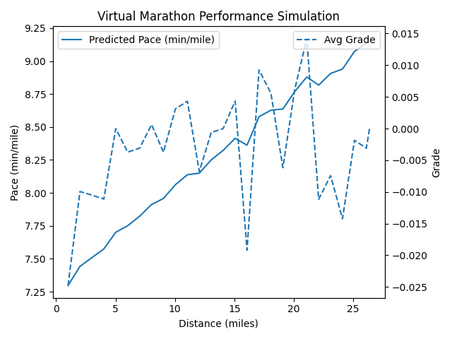

## Marathon Simulator – Predictive Running Performance on Real-World Routes
# Purpose
**Inspiration**:
As a runner, I wanted to visualize how I might perform on marathon routes like Boston and NYC. This project combines my personal Strava running data with marathon course GPX files to simulate my performance, accounting for terrain, fatigue, and historical pace behavior using deep learning.

# Description
This project provides a complete simulation pipeline for:

**Strava Integration** – Pulls recent activity data (pace, distance, elevation) using the Strava API.

**GPX Route Processing** – Parses real marathon GPX files to extract elevation profiles and distances.

**Pace Modeling** – Trains a regression model (LSTM) to predict pace based on grade and fatigue.

**Race Simulation** – Simulates predicted pace and total marathon time across each course segment.

**Performance Visualization** – Visual plots show projected splits, elevation, and fatigue-adjusted pace.

## Architecture & Design
-Strava API Integration (get_recent_activities, get_detailed_run_data)

-Authenticates via OAuth2

-Fetches time-series running data including heart rate, distance, and elevation

-GPX Route Processor (process_gpx_for_grade)

-Extracts elevation profile and calculates terrain grade per segment

-Feature Engineering (calculate_features, create_sequences)

-Computes pace, heart rate, and grade time-series data from activities

-LSTM Model (build_lstm_model)

-Predicts next-interval pace based on input sequence of HR, grade, and past pace

-Trained on your own historical runs

# Simulation & Inference

- Applies trained model to marathon GPX elevation data

- Estimates finish time by integrating predicted segment paces

## Data Flow
**Input**:

Personal Strava activity data

GPX files of marathon routes

**Processing**:

Embedding run sequences

Learning pace under different terrain + fatigue

Simulating new course run with learned dynamics

**Output**:

Estimated per-segment pace

Predicted total marathon time

Visual split and elevation profile charts

## Getting Started
# Install Dependencies
```bash
pip install requests gpxpy python-dotenv pandas numpy scikit-learn tensorflow
```
# Environment Variables
Create a .env file and add:
```bash
STRAVA_CLIENT_ID=your_client_id
STRAVA_CLIENT_SECRET=your_client_secret
STRAVA_REFRESH_TOKEN=your_refresh_token
``` 
# Usage
Run:
```bash
python mldj.py --gpx boston-marathon-course.gpx
```
This will:
1. Fetch Recent Activities
2. Train Pace Prediction Model
3. Simulate a Marathon
4. Applies model over course
5. Processes GPX

Output:
- Outputs recent run data and saves detailed activity info
- Builds and trains LSTM model
- Plots estimated pace, elevation, and split predictions

# Example
Run:
```bash
python mldj.py --gpx boston-marathon-course.gpx
```
```
Recent Runs, Paces (minutes/mile), and Average Heart Rate:
Activity: Run, Pace: 7.79 min/mile, Avg HR: N/A (No HR data)
Activity: Run, Pace: 8.39 min/mile, Avg HR: 156 bpm
Activity: Run, Pace: 9.18 min/mile, Avg HR: 155 bpm
Activity: Run, Pace: 8.97 min/mile, Avg HR: 167 bpm
Activity: Run, Pace: 8.30 min/mile, Avg HR: 165 bpm
Activity: Run, Pace: 8.75 min/mile, Avg HR: 169 bpm
Activity: Run, Pace: 8.46 min/mile, Avg HR: 147 bpm
Activity: Run, Pace: 8.72 min/mile, Avg HR: 171 bpm
Activity: Run, Pace: 8.95 min/mile, Avg HR: 163 bpm
Activity: Run, Pace: 8.12 min/mile, Avg HR: N/A (No HR data)
Activity: Run, Pace: 8.57 min/mile, Avg HR: 160 bpm
Activity: Run, Pace: 7.89 min/mile, Avg HR: N/A (No HR data)
Activity: Run, Pace: 9.21 min/mile, Avg HR: 162 bpm
Activity: Run, Pace: 8.44 min/mile, Avg HR: 162 bpm
Activity: Run, Pace: 7.73 min/mile, Avg HR: N/A (No HR data)
Activity: Run, Pace: 8.63 min/mile, Avg HR: 162 bpm
Activity: Run, Pace: 8.55 min/mile, Avg HR: 158 bpm
Activity: Run, Pace: 8.35 min/mile, Avg HR: 165 bpm
Activity: Run, Pace: 7.91 min/mile, Avg HR: N/A (No HR data)
Activity: Run, Pace: 8.40 min/mile, Avg HR: 168 bpm
Activity: Run, Pace: 7.90 min/mile, Avg HR: 170 bpm
Activity: Run, Pace: 8.41 min/mile, Avg HR: 160 bpm
Activity: Run, Pace: 8.30 min/mile, Avg HR: 166 bpm
Activity: Run, Pace: 7.25 min/mile, Avg HR: N/A (No HR data)
Activity: Run, Pace: 8.16 min/mile, Avg HR: 162 bpm
Activity: Run, Pace: 8.21 min/mile, Avg HR: 163 bpm
Activity: Run, Pace: 8.12 min/mile, Avg HR: 156 bpm
Activity: Run, Pace: 8.27 min/mile, Avg HR: 161 bpm
Activity: Run, Pace: 8.29 min/mile, Avg HR: 153 bpm
Activity: Run, Pace: 8.35 min/mile, Avg HR: 135 bpm
Activity: Run, Pace: 8.06 min/mile, Avg HR: 158 bpm
Activity: Run, Pace: 8.23 min/mile, Avg HR: 165 bpm
Activity: Run, Pace: 8.27 min/mile, Avg HR: 164 bpm
Activity: Run, Pace: 8.14 min/mile, Avg HR: 157 bpm
Activity: Run, Pace: 9.25 min/mile, Avg HR: N/A (No HR data)
Activity: Run, Pace: 9.28 min/mile, Avg HR: 166 bpm
Activity: Run, Pace: 8.22 min/mile, Avg HR: 137 bpm
Activity: Run, Pace: 8.63 min/mile, Avg HR: 155 bpm
Activity: Run, Pace: 8.11 min/mile, Avg HR: 135 bpm
Activity: Run, Pace: 8.52 min/mile, Avg HR: 166 bpm
Activity: Run, Pace: 8.30 min/mile, Avg HR: 159 bpm
Activity: Run, Pace: 8.46 min/mile, Avg HR: 160 bpm
Activity: Run, Pace: 8.07 min/mile, Avg HR: 161 bpm
Activity: Run, Pace: 7.62 min/mile, Avg HR: N/A (No HR data)
Activity: Run, Pace: 7.01 min/mile, Avg HR: N/A (No HR data)
Activity: Run, Pace: 8.33 min/mile, Avg HR: 171 bpm
Activity: Run, Pace: 8.11 min/mile, Avg HR: 141 bpm

--- Proceeding with model training and route simulation (using only run data with heart rate) ---

Predicted Marathon Completion Time: 0 days 03:38:22.462853223
```

